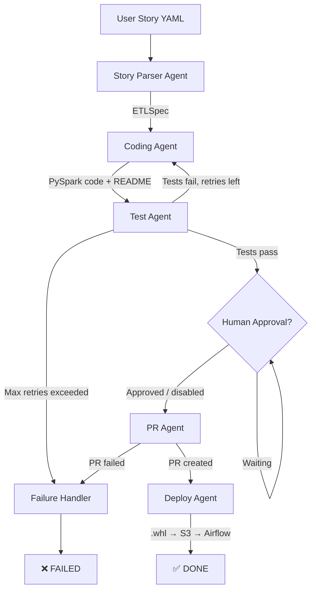
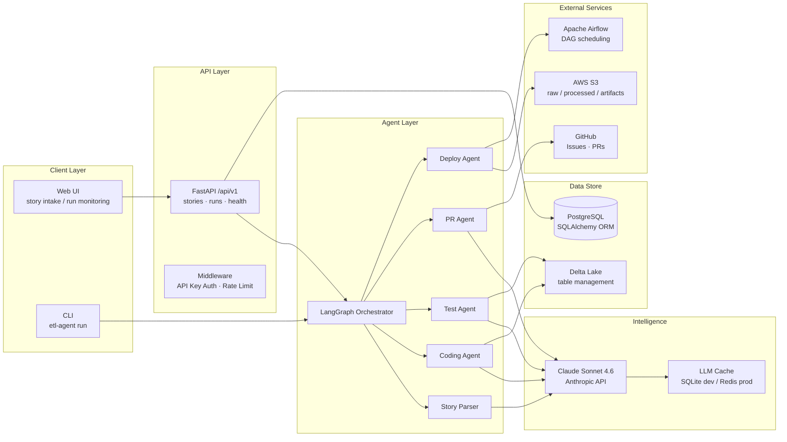

# Architecture — Autonomous ETL Agent

## System Overview

The Autonomous ETL Agent is a multi-agent AI system that transforms DevOps user stories
into production-ready PySpark pipelines, tests, and Pull Requests — autonomously.

## Agent Pipeline (LangGraph State Machine)

## Component Diagram

## Technology Choices & Rationale

| Component | Choice | Rationale |
|---|---|---|
| LLM | Claude Sonnet 4.6 | Best structured output quality, long context |
| Agent Framework | LangGraph | Stateful, conditional edges, retry loops |
| ETL Engine | PySpark 3.5 + Delta Lake | Industry standard; ACID on data lakes |
| API | FastAPI + Uvicorn | Async, auto-docs, Pydantic integration |
| Database | SQLAlchemy 2.0 async | Type-safe ORM, async sessions |
| Storage | AWS S3 | Industry standard object store |
| Orchestration | Apache Airflow | Widely adopted, REST API triggerable |
| Package Manager | UV | Fastest Python package manager |
| IaC | Terraform | Reproducible cloud infrastructure |
